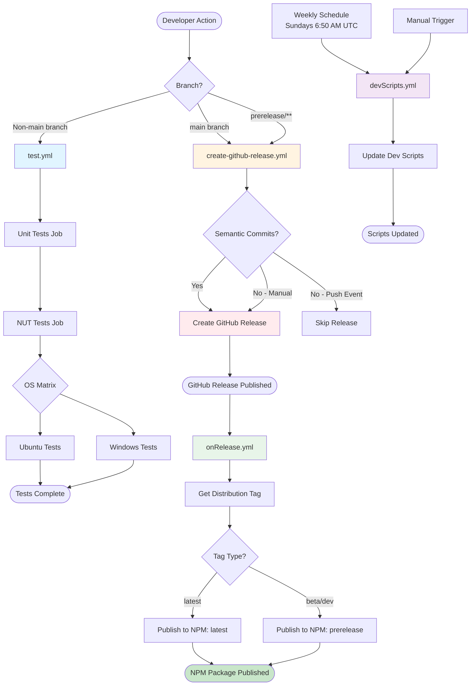
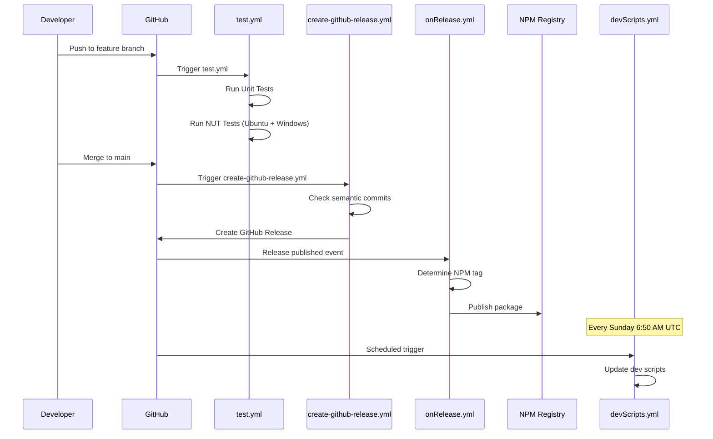
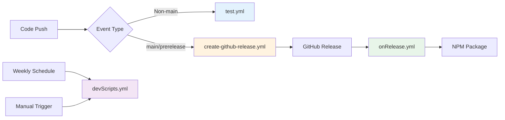

# CI/CD Workflows Documentation

This document describes the GitHub Actions workflows for the org-analyzer project. These workflows automate testing, release creation, NPM publishing, and maintenance tasks.

## Overview

The following diagram shows the overall workflow relationships and when each workflow is triggered:



## Workflow Sequence

The following sequence diagram shows the chronological flow of events:



## Workflow Details

### 1. test.yml

**Purpose:** Run automated tests on feature branches before merging to main.

**File:** [`.github/workflows/test.yml`](workflows/test.yml)

**Triggers:**
- Push to any branch except `main`
- Manual trigger via `workflow_dispatch`

**Jobs:**
1. **unit-tests**: Runs unit tests using Salesforce CLI testkit
2. **nuts**: Runs NUT (NPM Unit Tests) on multiple operating systems
   - Tests on Ubuntu and Windows (matrix strategy)
   - Only runs after unit tests pass
   - Uses `fail-fast: false` to test all OS even if one fails

**Key Features:**
- Prevents broken code from reaching main branch
- Cross-platform testing ensures compatibility
- Uses reusable workflows from `salesforcecli/github-workflows`

**Related Files:**
- Test files: [`test/commands/data-dictionary/generate.test.ts`](../test/commands/data-dictionary/generate.test.ts)
- NUT files: [`test/commands/data-dictionary/generate.nut.ts`](../test/commands/data-dictionary/generate.nut.ts)

---

### 2. create-github-release.yml

**Purpose:** Automatically create GitHub releases from semantic commit messages.

**File:** [`.github/workflows/create-github-release.yml`](workflows/create-github-release.yml)

**Triggers:**
- Push to `main` branch
- Push to `prerelease/**` branches
- Manual trigger via `workflow_dispatch` (with optional prerelease name)

**How it works:**
1. Analyzes commit messages for semantic versioning prefixes:
   - `fix:` → patch version (1.1.3 → 1.1.4)
   - `feat:` → minor version (1.1.3 → 1.2.0)
   - `BREAKING CHANGE:` → major version (1.1.3 → 2.0.0)
2. Creates a GitHub release with changelog
3. Skips release if no semantic commits found (on push events)
4. Manual trigger bypasses skip-on-empty check

**Key Features:**
- Automatic versioning based on commit messages
- Supports prerelease branches (beta, dev, etc.)
- Generates changelog from commits
- Uses reusable workflow from Salesforce CLI

**Required Secrets:**
- `SVC_CLI_BOT_GITHUB_TOKEN`: GitHub token for creating releases

**Example Commit Messages:**
```bash
fix: resolve TypeScript compilation error
feat: add new data dictionary export format
feat!: breaking change in API structure
```

---

### 3. onRelease.yml

**Purpose:** Automatically publish the package to NPM when a GitHub release is published.

**File:** [`.github/workflows/onRelease.yml`](workflows/onRelease.yml)

**Triggers:**
- When a GitHub release is published (both regular and prereleases)
- Manual trigger via `workflow_dispatch` (requires tag input)

**How it works:**
1. Determines NPM distribution tag based on release tag:
   - Regular releases → `latest` tag
   - Prereleases (beta, dev, etc.) → corresponding prerelease tag
2. Publishes package to NPM with appropriate tag
3. Uses reusable workflow from Salesforce CLI

**Key Features:**
- Automatic NPM publishing on release
- Handles both stable and prerelease versions
- Can be manually triggered to republish if needed

**Required Secrets:**
- `NPM_TOKEN`: NPM authentication token

**NPM Tags:**
- `latest`: Latest stable release
- `beta`: Beta prereleases
- `dev`: Development prereleases
- Other prerelease tags as specified

---

### 4. devScripts.yml

**Purpose:** Keep development scripts and tooling up to date with Salesforce CLI standards.

**File:** [`.github/workflows/devScripts.yml`](workflows/devScripts.yml)

**Triggers:**
- Weekly schedule: Every Sunday at 6:50 AM UTC (`cron: '50 6 * * 0'`)
- Manual trigger via `workflow_dispatch`

**How it works:**
- Updates development scripts from Salesforce CLI workflows repository
- Ensures project follows latest Salesforce CLI best practices
- Uses reusable workflow from Salesforce CLI

**Key Features:**
- Automated maintenance of dev tooling
- Keeps project aligned with Salesforce CLI standards
- Can be triggered manually for immediate updates

**Required Secrets:**
- `SVC_CLI_BOT_GITHUB_TOKEN`: GitHub token for accessing workflows repository

---

## Workflow Relationships

The following diagram shows how workflows depend on and interact with each other:



## Troubleshooting

### test.yml Issues

**Problem: Tests failing on one OS but not another**
- **Solution:** Check OS-specific dependencies or path handling. The workflow uses `fail-fast: false` to test all OS, so review logs for both Ubuntu and Windows.

**Problem: Unit tests pass but NUT tests fail**
- **Solution:** NUT tests require Salesforce org access. Ensure secrets are properly configured:
  - Check repository secrets in Settings → Secrets and variables → Actions
  - Verify org credentials are valid

**Problem: Workflow not triggering on feature branch**
- **Solution:** 
  - Verify branch name is not `main`
  - Check if workflow file is in `.github/workflows/` directory
  - Ensure YAML syntax is valid

---

### create-github-release.yml Issues

**Problem: No release created after merging to main**
- **Solution:** 
  - Check commit messages for semantic prefixes (`fix:`, `feat:`, etc.)
  - Verify `SVC_CLI_BOT_GITHUB_TOKEN` secret is set
  - Check workflow logs for errors
  - Use manual trigger (`workflow_dispatch`) to bypass skip-on-empty

**Problem: Wrong version number in release**
- **Solution:** 
  - Review commit messages - version is determined by semantic commit types
  - Check `package.json` version matches expected version
  - Verify no conflicting version tags exist

**Problem: Prerelease not working**
- **Solution:**
  - Ensure branch name matches `prerelease/**` pattern
  - Check `package.json` for prerelease version format
  - Verify prerelease input parameter if using manual trigger

---

### onRelease.yml Issues

**Problem: Package not published to NPM**
- **Solution:**
  - Verify `NPM_TOKEN` secret is configured correctly
  - Check NPM token has publish permissions
  - Review workflow logs for authentication errors
  - Ensure package name in `package.json` matches NPM package name

**Problem: Wrong NPM tag used**
- **Solution:**
  - Check release tag format - determines distribution tag
  - Verify `getDistTag` job output in workflow logs
  - Prerelease tags should include prerelease identifier (e.g., `1.2.0-beta.1`)

**Problem: Manual republish needed**
- **Solution:**
  - Use `workflow_dispatch` with the tag input
  - Provide the exact GitHub tag name that needs republishing
  - Check logs to verify tag was found

---

### devScripts.yml Issues

**Problem: Scripts not updating**
- **Solution:**
  - Verify `SVC_CLI_BOT_GITHUB_TOKEN` secret is set
  - Check if workflow ran (view workflow runs)
  - Manually trigger workflow to test
  - Review logs for errors accessing workflows repository

**Problem: Updates breaking the build**
- **Solution:**
  - Review changes in the PR created by the workflow
  - Test locally before merging
  - Consider pinning to specific workflow version if needed

---

## Common Workflow Patterns

### Semantic Commit Messages

For automatic releases, use these commit message prefixes:

- **Patch release** (`1.1.3` → `1.1.4`):
  ```
  fix: description of bug fix
  ```

- **Minor release** (`1.1.3` → `1.2.0`):
  ```
  feat: description of new feature
  ```

- **Major release** (`1.1.3` → `2.0.0`):
  ```
  feat!: breaking change description
  ```
  or
  ```
  feat: description
  
  BREAKING CHANGE: explanation of breaking change
  ```

### Manual Release Process

If you need to create a release manually:

1. Go to Actions → `create-github-release` → Run workflow
2. Optionally specify prerelease name
3. Click "Run workflow"
4. Release will be created even without semantic commits

### Checking Workflow Status

1. **View all workflow runs:**
   - Go to repository → Actions tab
   - Click on specific workflow to see runs

2. **View workflow logs:**
   - Click on a workflow run
   - Expand job to see step logs
   - Check for error messages

3. **Monitor workflow health:**
   - Check repository badges in README
   - Review recent workflow runs for failures
   - Set up notifications for workflow failures

## Related Documentation

- [README.md](../README.md) - Project overview and usage
- [CHANGELOG.md](../CHANGELOG.md) - Version history
- [package.json](../package.json) - Project dependencies and scripts

## Workflow Files Reference

- [`test.yml`](workflows/test.yml) - Testing workflow
- [`create-github-release.yml`](workflows/create-github-release.yml) - Release creation workflow
- [`onRelease.yml`](workflows/onRelease.yml) - NPM publishing workflow
- [`devScripts.yml`](workflows/devScripts.yml) - Development scripts update workflow

## Additional Resources

- [GitHub Actions Documentation](https://docs.github.com/en/actions)
- [Salesforce CLI GitHub Workflows](https://github.com/salesforcecli/github-workflows)
- [Semantic Versioning](https://semver.org/)
- [Conventional Commits](https://www.conventionalcommits.org/)


